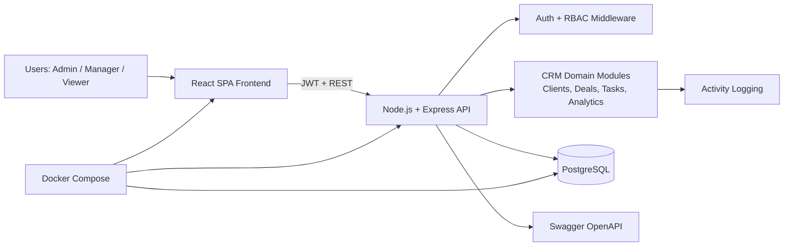

# CRM System Architecture

## High-level architecture diagram

## Backend architecture (modular MVC + service layer)

- **Routes**: HTTP endpoint declaration and middleware composition.
- **Controllers**: Request parsing + response formatting.
- **Services**: Business logic and Prisma data access.
- **Middlewares**: JWT auth, RBAC checks, validation, error handling, rate limiting.
- **Utils/Config**: shared helpers, env parsing, logger, Prisma client.

This structure keeps API modules isolated and scalable while preserving a clean flow:

`Request -> Middleware -> Controller -> Service -> Prisma -> PostgreSQL`

## Frontend architecture

- **App Shell**: sidebar + topbar layout.
- **Feature slices** (`Redux Toolkit`): auth, clients, deals, tasks, analytics, theme.
- **Pages**: route-level screens (Dashboard, Customers, Deals, Tasks, Auth pages).
- **API layer**: Axios client with JWT interceptor.
- **Routing**: React Router + protected route wrapper.

## Security and operational concerns

- JWT authentication with role claims.
- RBAC (`ADMIN`, `MANAGER`, `VIEWER`) enforced on backend routes.
- Password hashing via bcrypt.
- Validation with Zod (backend) and controlled UI inputs (frontend).
- Rate limiting, Helmet, CORS controls.
- Structured JSON logging and activity/audit events.
