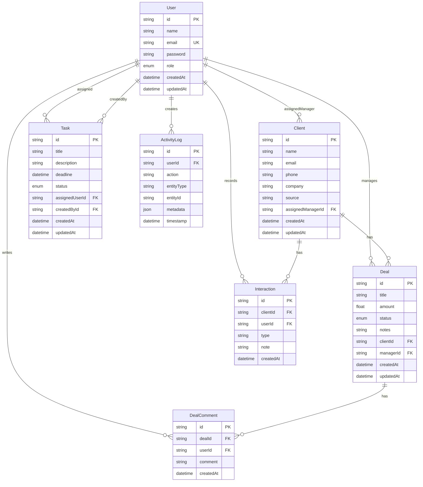

# ER Diagram

## Indexing highlights

- `Client(name, company)`, `Client(email)`, `Client(source)`, `Client(assignedManagerId)`
- `Deal(status)`, `Deal(managerId, status)`, `Deal(clientId)`
- `Task(status, deadline)`, `Task(assignedUserId)`
- `ActivityLog(entityType, entityId)`, `ActivityLog(userId, timestamp)`
